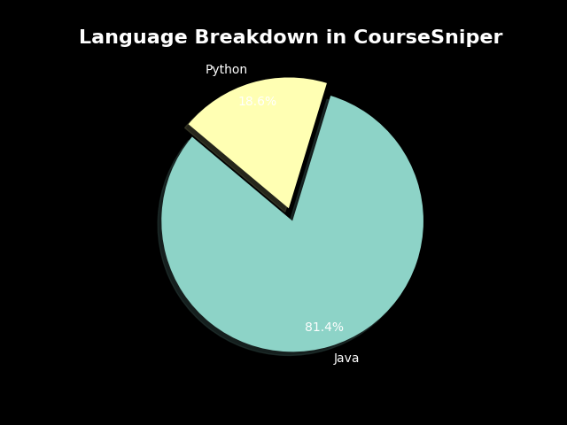
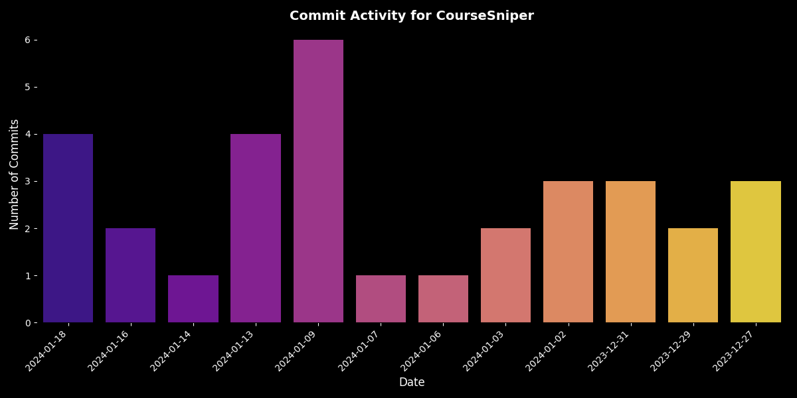

#Course Sniper

> Never Miss a Seat in your Favorite Class again!

## 📖 Table of Contents

- [Introduction](#introduction)
- [Quick Stats](#quick-stats)
- [Features](#features)
- [Recent Activity](#recent-activity)
- [How It Works](#how-it-works)
- [Technical Architecture](#technical-architecture)
- [Installation](#installation)
- [Usage](#usage)
- [API Documentation](#api-documentation)
- [See it Live](#see-it-live)
- [Contributing](#contributing)
- [Team](#team)
- [License](#license)
- [Acknowledgments](#acknowledgments)

## 💡 Introduction

The idea for this arose from our school not having an alert system for when a seat opens up.
Last semester, a required course for my major with my favorite professor filled up overnight
The college's course catalog is not optimized for mobile browsers
The only way I could check for a seat becoming availbe was by carrying my laptop with me.

## 📊 Quick Stats

- Language: JavaScript, Java, Python, SQL
- Dependencies: 5
- Last Commit: 2 days ago
- Active Contributors: 4
# 🔥 Features

- :mortar_board: Course Selection: Select multiple courses that you wish to track
- ⚙️ Feature 2: Detailed description
- 🎨 Feature 3: Detailed description
